<!--
*** Thanks for checking out this README Template. If you have a suggestion that would
*** make this better, please fork the tinyml-mapping-backlight and create a pull request or simply open
*** an issue with the tag "suggest".
*** Thanks again! Now go create something AMAZING! :D
***
***
***
*** To avoid retyping too much info. Do a search and replace for the following:
*** fullmakeralchemist, tinyml-mapping-backlight, twitter_handle, fullmakeralchemist@gmail.com   
-->

<!--#     The TensorFlow Microcontroller Challenge    -->
   <h1>🏆 Winner of the Tensorflow Lite Microcontroller Challenge 🏆</h1>

<!-- PROJECT LOGO -->
<br />
<p align="center">
  <a href="https://github.com/fullmakeralchemist/tinyml-mapping-backlight">
    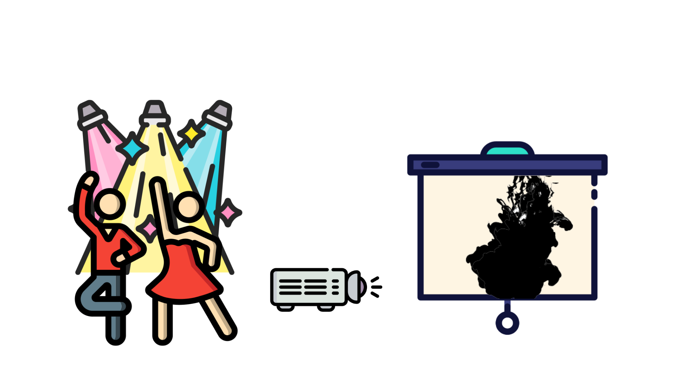
  </a>
  <br />

  
  
  
  

  <a href="https://www.linkedin.com/in/fullmakeralchemist/">
    
  </a>
  <a href="https://twitter.com/makeralchemist/">
    
  </a>
   <h3 align="center">Tiny ML in Mapping Dance, Visual Arts and interactive museums</h3>
  <p align="center">
    Because Art Inspired Technology, Technology Inspired Art
    <br />
    <a href="https://experiments.withgoogle.com/mapping-dance"><strong>View the project»</strong></a>
    <br />
  </p>
  <p align="center">
  <a href="https://experiments.withgoogle.com/mapping-dance">
    
  </a>
  </p>
  <br />
</p>
<br />

<!-- TABLE OF CONTENTS -->
## Table of Contents

* [About the Project](#about-the-project)
  * [Motivation](#motivation)
  * [Built With](#built-with)
* [Getting Started](#getting-started)
  * [Prerequisites](#prerequisites)
  * [Installation](#installation)
* [Usage](#usage)
  * [Data Exploration](#data-exploration)
  * [Model Training](#model-training)
  * [Mapping and lightning Script Running](#mapping-and-lightning-script-running)
  * [Perform the Model](#perform-the-model)
* [Kinetic Sculpture](#kinetic-sculpture)
* [Challenges I ran into and What I learned](#challenges-i-ran-into-and-what-i-learned)
* [Observations about the project](#observations-about-the-project)
* [Accomplishments that I'm proud of](#accomplishments-that-im-proud-of)
* [What's next for Tiny ML in Mapping Dance, Visual Arts and interactive museums](##whats-next-for-tiny-ml-in-mapping-dance-visual-arts-and-interactive-museums)
* [License](#license)
* [Contact](#contact)

<!-- ABOUT THE PROJECT -->
## About The Project

<!-- [](https://www.youtube.com/watch?v=3YUVTDTo-Zk) -->


An intelligent assistant device to track moves with responses during a dance performance or an interactive building with mapping and Backlight.

This project makes use of a machine learning algorithm capable of tracking and detecting moves to identify associated gesture recognition through a microcontroller. This allows the corresponding media, lightning and kinetic sculpture set to play when the right move was made because lighting interacts with all the visuals of a stage creating a new experience.


### Motivation

Some facts:

- There are a lot of new art projects adding technology nowadays.
- Factors like the difficulties that artists come up with during their attempts to familiarize with new technologies, so that they can integrate them in their projects.
- High cost of buying and installing new software together with its supporting systems.
- Limited access that a large percentage of the student population has to new technologies made it sometimes **difficult to use technology in dance**.

##### Technology in art can be an element for good, but only when everyone is included.

Interactive multimedia is one of the most important applications of technology. It is one of the most accessible technological innovations, which does not require expert knowledge in computer programming. Interactive multimedia involves a lot of elements (i.e. text, image, sound, graphics, etc.) all included in an easy learning environment where creative action and inquiry have the primary role.

### Built With

With a lot of love 💖, motivation to help others 💪🏼 and [Python](https://www.python.org/) 🐍, using:

* [Tensorflow 2.0](https://www.tensorflow.org/)
* [Google Colab](https://colab.research.google.com/)  (with its wonderful GPUs)
* Model quantization with `tf.lite` for serving ⚙️
* Encode the Model in an Arduino Header File
* A [Raspberry Pi](https://www.raspberrypi.org/) 4 
* A [Arduino Nano 33 BLE SENSE](https://store.arduino.cc/usa/nano-33-ble-sense)
* A [NodeMCU ESP8266](https://nodemcu.readthedocs.io/en/release/) board
* The MQTT [Mosquitto](https://mosquitto.org/) Broker
* The [Eclipse Paho](http://eclipse.org/paho/) MQTT Python client [library](https://pypi.org/project/paho-mqtt/)
* [PubSubClient library](https://github.com/knolleary/pubsubclient/archive/master.zip) in Arduino IDE for the ESP8266 Board
* Arduino IDE
* ESP8266 Board [Package](https://learn.adafruit.com/adafruit-feather-huzzah-esp8266/using-arduino-ide)
* Any projector or display with HDMI connection 


<!-- GETTING STARTED -->
## Getting Started

To get a local copy up and running follow these simple steps

### Prerequisites

This is an example of how to list things you need to use the software and how to install them. 

For this particular section I will suppose that you already have a Raspberry Pi already setup. If not I have a guide in Medium about [Getting started on Raspberry Pi 4](https://fullmakeralchemist.medium.com/setting-up-your-raspberry-pi-4-wireless-f51c16937d1e). Also you will need git installed on your system. If not, I have a guide posted on [Medium](https://fullmakeralchemist.medium.com/install-git-and-visual-studio-code-on-raspberry-pi-48d054fdee07) to do it .
For a general overview of the Arduino Nano 33 BLE Sense setup, you can check out the Arduino Guide on [Getting started with Arduino Nano 33 BLE Sense](https://www.arduino.cc/en/Guide/NANO33BLESense).

Before installing the libraries in Raspberry Pi run the following code lines in the Raspberry Pi terminal:

```
sudo apt update
sudo apt upgrade
```
After updating and upgrading we will write the following command:

```
sudo pip3 install python-vlc
```

To install the Mosquitto Broker enter these next commands:

```
pi@raspberry:~ $ sudo apt install -y mosquitto mosquitto-clients
```

You’ll have to type Y and press Enter to confirm the installation. To make Mosquitto auto start on boot up enter:

```
pi@raspberry:~ $ sudo systemctl enable mosquitto.service
```
```
pi@raspberry:~ $  mosquitto -v
```
This returns the Mosquitto version that is currently running in your Raspberry Pi. It should be 1.5.X or above.

<center>
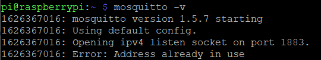
</center>

#### Raspberry Pi IP Address & Paho Package

To use Mosquitto broker later on your projects, you’ll need your Raspberry Pi IP address. To retrieve your Raspberry Pi IP address, type the next command in your Terminal window:
```
pi@raspberry:~ $ hostname -I
```
<center>
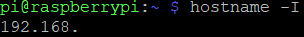
</center>

The Paho package provides a client class which enables applications to connect to an MQTT broker to publish messages, and to subscribe to topics and receive published messages. In this project, the Python script is going to publish messages to the ESP8266 to turn the GPIOs on and off to control the lights.
To install paho-mqtt run the following command:

```
sudo pip install paho-mqtt
```

And those are the steps that we will follow to set up our Raspberry Pi. In any case, this specific setup can be seen in the corresponding [Raspberry_Script](https://github.com/fullmakeralchemist/tinyml-mapping-backlight/tree/master/Raspberry_Script) folder.

Now lets see the setup for the Arduino IDE

#### Setup Arduino IDE

To install the ESP8266 Board Package enter:

```
http://arduino.esp8266.com/stable/package_esp8266com_index.json
```
Into Additional Board Manager URLs field in the Arduino v1.6.4+ preferences.

<center>
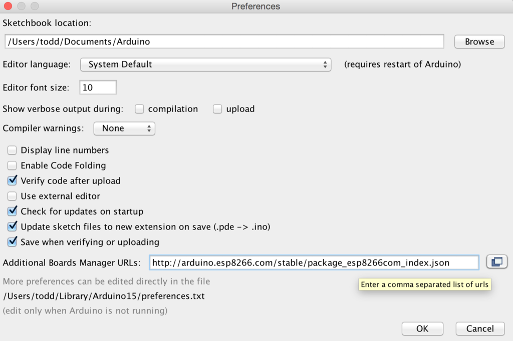
</center>

Next, use the Board manager to install the ESP8266 package.

<center>
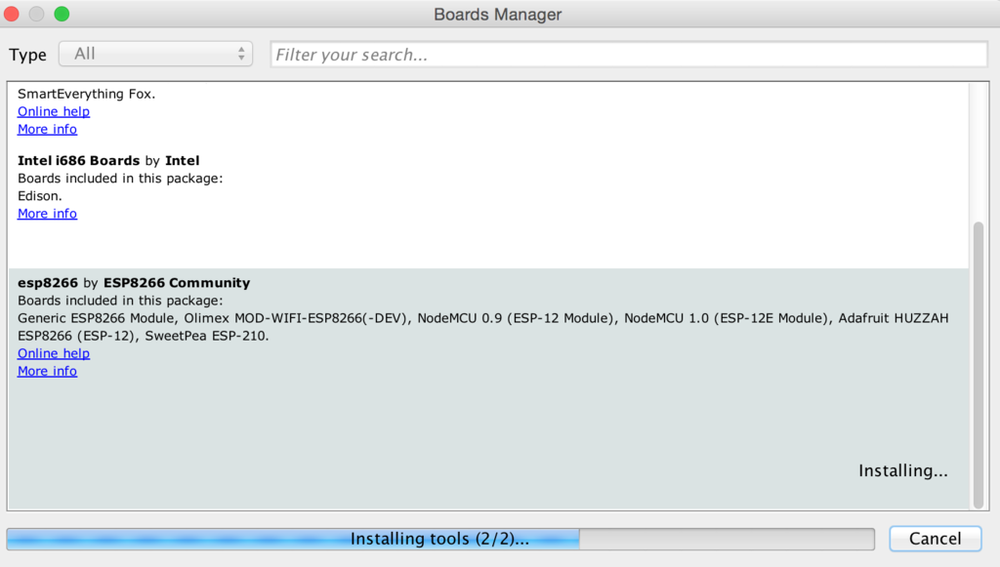
</center>

After the install process, you should see that esp8266 package is marked INSTALLED. Close the Boards Manager window once the install process has completed.

Setup ESP8266 Support When you've restarted, select Adafruit Feather HUZZAH ESP8266  from the Tools->Board dropdown.

<center>
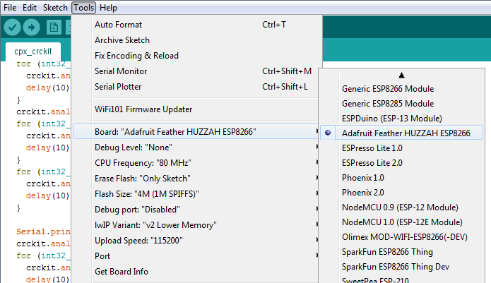
</center>

#### Getting the MQTT library for the ESP8266
For the ESP8266 to interact with the Raspberry Pi web server, you need to install the PubSubClient [library](https://github.com/knolleary/pubsubclient). This library provides a client for doing simple publish/subscribe messaging with a server that supports MQTT (basically allows your ESP8266 to talk with a Python web server).

##### Installing the Library
1. [Click here to download the PubSubClient library](https://github.com/knolleary/pubsubclient/archive/master.zip). You should have a .zip folder in your Downloads folder
2. Unzip the .zip folder and you should get pubsubclient-master folder
3. Rename your folder from pubsubclient-master to pubsubclient
4. Move the pubsubclient folder to your Arduino IDE installation libraries folder
5. Then, re-open your Arduino IDE

The library comes with a number of example sketches. See File > Examples > PubSubClient within the Arduino IDE software.

Finally, you can upload the full [sketch](https://github.com/fullmakeralchemist/tinyml-mapping-backlight/tree/master/ESP8266_Sketches/lightsmqtt) to your ESP8266 (replace with your SSID, password and RPi IP address **see the comments in the sketch**):

### Run the script


Clone the tinyml-mapping-backlight repo, download it or just copy and paste from the files from this repo:
bash
```
git clone https://github.com/fullmakeralchemist/tinyml-mapping-backlight
```

The simplest way is just using the Thonny IDE which is included with Raspberry Pi OS, Thonny comes with Python 3.6 built in, so you don’t need to install anything. Just open up the program, which you’ll find under Menu > Programming. It offers a lot of advanced features not currently available in the Python 3 (IDLE) program. Also you can follow my guide to install Visual Studio Code, but some libraries show some errors trying to run the script. So I recommend you to use the Thonny IDE.

<center>
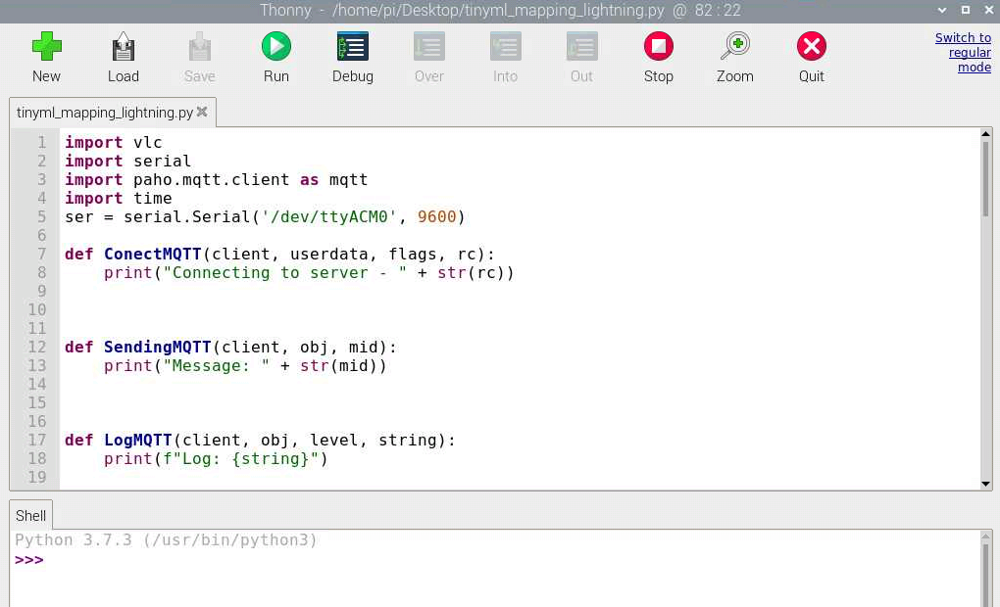
</center>

<!-- USAGE EXAMPLES -->
## Usage

### Data Exploration

The dataset used for this project was obtained from the capture_acc_gyro file, you can find it in the [Repository](https://github.com/fullmakeralchemist/tinyml-mapping-backlight/tree/master/Arduino_Sketches/capture_acc_gyro). This dataset records 119 x,y and z acceleration and gyroscope data from on-board IMU and prints it to the Serial Monitor for one second when the significant motion is detected and prints the data in CSV format. This data will be copied and pasted into a text file and this text fill will be saved as a CSV file. To be uploaded to the Google Collab [Notebook](https://github.com/fullmakeralchemist/tinyml-mapping-backlight/blob/master/notebook/tinyml_Gesture.ipynb) to train.
<center>
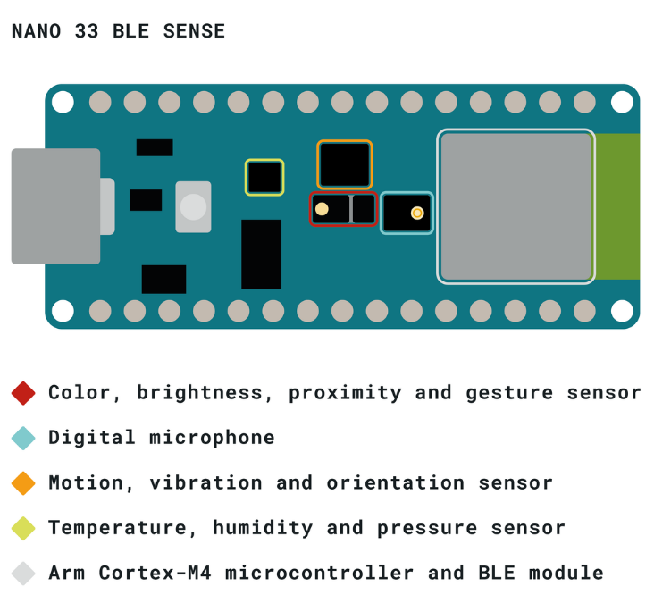
</center>

### Model Training

After reading Tiny ML Machine Learning with TensorFlow Lite on Arduino and Ultra-Low-Power Microcontrollers, I found this [resource](https://github.com/arduino/ArduinoTensorFlowLiteTutorials/) that helped me a lot to just focus on making some tests with different movements, training and testing with the Arduino board.

<center>
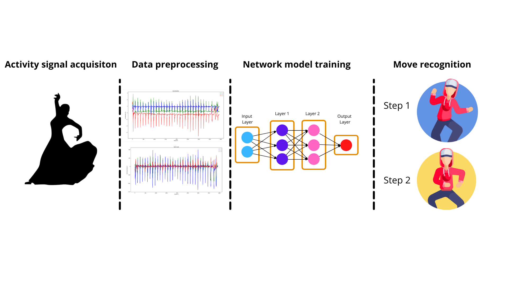
</center>

As part of the project development I have implemented the proposed model using Tensorflow 2.0. For training I used the previously mentioned CSV files obtained from Arduino on a Google Colab environment using GPUs. So far the model was trained for 600 epochs using a batch size of 64. The training history can be seen in the following graphs:

<center>
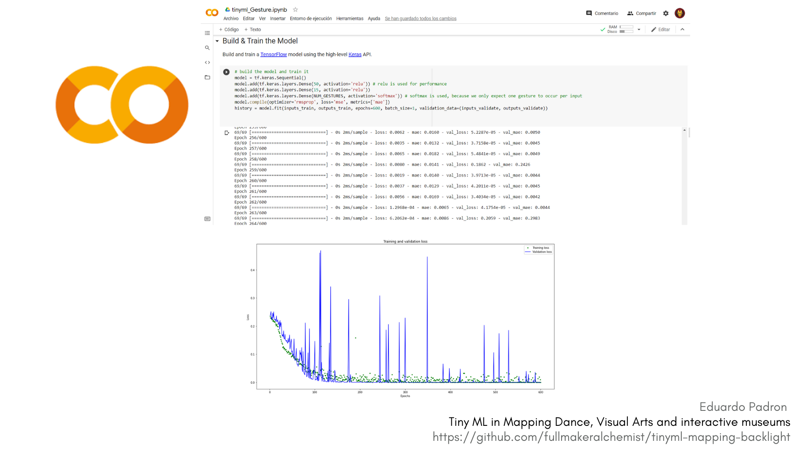
</center>

Although the results may not seem quite good, the model has achieved an accuracy value of 0.9149 on the validation dataset with 600 training epochs, with a record of at least 20 repeats of the movement recorded with the arduino capture file, also I try with 30 and 40 reparts, with more repetitions of the movement gets a better result, the problem is it gets tired repeat a movement so many times. We can get a general idea of the model performance in the arduino [TinyIMU file](https://github.com/fullmakeralchemist/tinyml-mapping-backlight/tree/master/Arduino_Sketches) running the model printing the **line data.f[i] in the loop through the output tensor values from the model**.

The trained model architecture, quantized model with tflite and encoded the Model in an Arduino Header File(for the deployment in the Arduino board) can be found in the model folder. Finally, if you want to re-train the model and verify the results on your own, you have to upload the csv files found in this [folder](https://github.com/fullmakeralchemist/tinyml-mapping-backlight/tree/master/CSV_Files).

### Mapping and lightning Script Running

<center>

</center>

The script is the base of interaction for the player of mapping and lightning during the movements made. 
The script has been entirely developed with Python on top of a VLC and MQTT integration, for a more intuitive and synchronous interaction. The script serves a real-time player, and lightning activation is served through the trained model that is deployed on the Arduino Nano 33 BLE Sense, which sends the data by serial connection to a ESP8266 board wireless using the MQTT broker. The script has to be changed on the line using the IP from the Raspberry to access the remote control of the lights and if the media is differente will have to be changed the path and the file name. I added the media that I used for this project on this [link](https://drive.google.com/drive/folders/1uIEMpqL8vLfNuTHD6CSaq_Hc-jH8DiS8?usp=sharing).

<center>
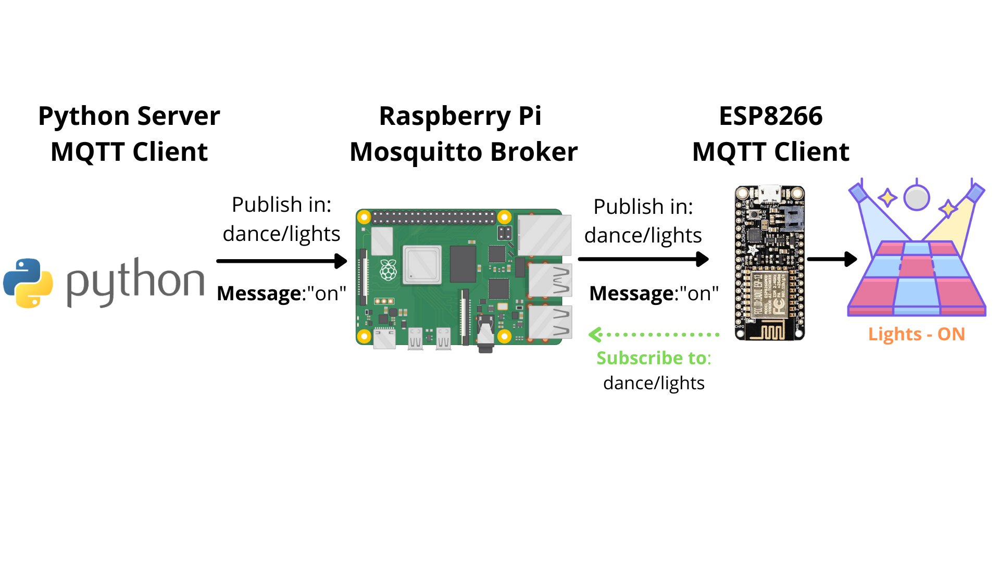
</center>

### Perform the Model

The following image illustrates a general idea of the model working with the Raspberry Pi and the ESP8266 :

<center>
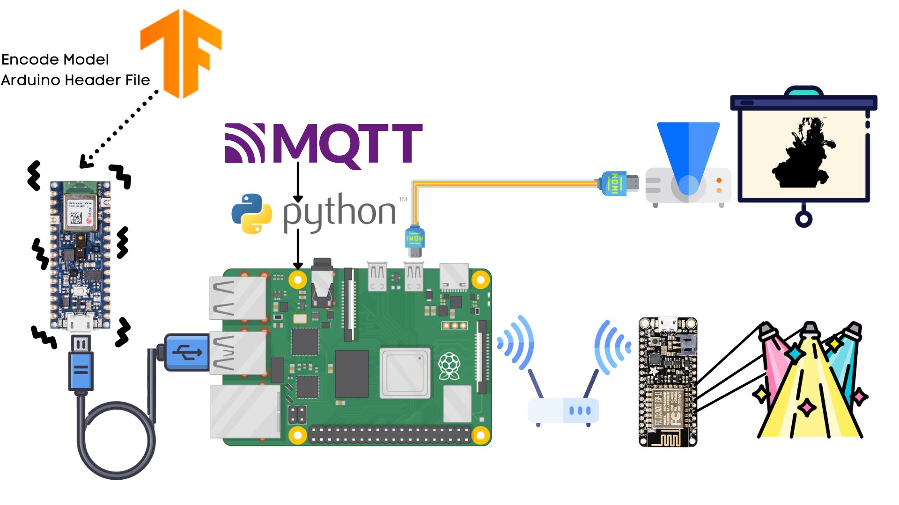
</center>

Once that model has been trained, saved, quantized, encoded in an Arduino Header File to use in an Arduino Nano 33 BLE Sense and downloaded, the model has been ported into a TinyIMU Ino file. The Arduino connects directly to the Raspberry, then the lights mqtt ino file is uploaded to the ESP8266 board. We can run the script to run the animation on the projector and activate the lights as the deployed model predicts ([Raspberry Pi Script](https://github.com/fullmakeralchemist/tinyml-mapping-backlight/tree/master/Raspberry_Script) **Beforre runing the script make sure that the path on the script condition is right**).

The script that serves as the interface between the Raspberry Pi, Arduino and the ESP8266 BOARD is capable of printing the state of the VLC player as well as the MQTT connection don’t need the internet connection, just connected to the same router that is connected the ESP8266 board and the Arduno also can works on a hotspot in a smartphone. In general, the script takes only ~14% of the Raspberry Pi CPU it could be more if there are a lot of VLC windows open so I add a condition related to the state of the player so when the animation is over the player is closed to reduce the CPU use to avoid unnecessary CPU usage.

## Kinetic Sculpture

The kinetic sculpture is a concept. A small servo motor controls the movement in the sculpture. This could be added to the performance as a “dance partner” expanding the possibilities of creativity for the artist with this kind of elements, also in a museum maybe adding in a planetarium to start a cinematic with planet movements as an example of this automation applications with Tiny ML. Here are some examples of motors that could be integrated.

<center>

</center>

<center>

</center>

<center>

</center>

<center>

</center>

## Challenges I ran into and What I learned

One of the main challenges was to create a model in Tensorflow without having much knowledge about Machine Learning, my major area of studies is hydrology, and irrigation. That's why I got the Tiny ML book from Pete Warden and Daniel Situnayake and then I found the Tiny Ml Workshop resource may result in the most suitable code resource to tackle this area of necessity. 

The second main challenge (once I learned about creating the model on Arduino) was to create bluetooth connections without having much knowledge about the BLE library, I used before for other irrigation projects WiFi connection using Firebase real-time database and MQTT. This is why I found that Mosquitto and Paho on Raspberry Pi may result in the most suitable technologies to tackle wireless connection, so it could get control in real-time. 

Finally, this is the first time I use a trained model using tflite on an Arduino with Raspberry Pi. In the end, I learned that whenever you may think that you found no way out, the motivation may help you to find alternative solutions with new technologies.

**About the Bluetooth attempt here is the script and the sketch to get data through a [bluetooth connection](https://github.com/fullmakeralchemist/tinyml-mapping-backlight/tree/master/Bluetooth_attempt) follow the instructions**

## Observations about the project

The Bluetooth connection has a limited number of devices to connect on the Raspberry Pi, it only allows 7 devices using bluetooth. In windows is 10 devices so with a lot of dancers it will be difficult using bluetooth. 

Training the moves could be hard doing more than 20 repetitions of a movement, also I realize recording the moves, that is necessary to be really precise doing the movements, the difference in each repetition affects the model precision. 

## Accomplishments that I'm proud of

- Building a custom script to just change a few variables
- Sending data using the BLE library to my laptop using Python
- Sending messages to a ESP8266 board using MQTT
- Learning new technologies in a record time
- Start creating a tool that will help others

## What's next for Tiny ML in Mapping Dance, Visual Arts and interactive museums

- Develop own embedded device for the model deployment (which should already include a accelerometer, gyroscope and a wifi connection)
- Improve user data acquisition through the accelerometer and gyroscope.
- Add Bluetooth recording of accelerometer and gyroscope (you can find a file using python as a receiver of the information and the INO file that sends the data through the BLE library).
- Implement in a dance presentation or a museum (also in my house in holidays)
- Add kinetic sculptures with servo motors to add an effect like the matilda movie.
- Test prototype with a dancer.
- Add the MadMapper API to add more visual effects with the animations.

<center>

</center>

## License


<!-- CONTACT -->
## Contact

Eduardo Padron - [@makeralchemist](https://twitter.com/makeralchemist) - 

Project Link: [https://github.com/fullmakeralchemist/tinyml-mapping-backlight](https://github.com/fullmakeralchemist/tinyml-mapping-backlight)

IF YOU THINK THAT YOU CAN HELP ME TO HELP OTHERS, PLEASE DO NOT HESITATE TO CONTACT ME.

<!-- ACKNOWLEDGEMENTS -->
## Acknowledgements

* Icons made by [Flat Icons](https://www.flaticon.com/authors/flat-icons) from [www.flaticon.com](https://www.flaticon.com/)
* Images and gifs made by [Canva](https://www.canva.com/) 
* Thanks to the Tensorflow team Arduino and Raspberry Pi for developing such an incredible technology